# SwiftUI-Apps
SwiftUI Apps created for self development and practice.

 

## Table of contents

- [Units](#units)
- [RPS](#rps)
- [Edutainment - Math Game](#edutainment---math-game)

 

## Units
Simple temperature conversion app to units like Celsius, Fahrenheit, or Kelvin.

<h3>Illustrations</h3

<h3>Features</h3>

- Screens: Temperature Conversion
- Pure SwiftUI
- Handles temperature conversion in Celsius, Fahrenheit, or Kelvin
- calculation performed using Apple Measurement API
- keyboard dismiss using @FocusState property wrapper
- Custom Fonts and colors as per Apple Human Guidelines
- Tested on physical and simulator
- Dark Mode Support
- Auto Layout for all iPhones

 

## RPS
Simple RPS - Rock, Paper, Scissors game app that challenges player to tap correct move based on app randomly picked (Rock, Paper or Scissors) with random prompt to win or lose with live scoring (you can score a point or lose a point), move progress, final score alert message, restart etc.

<h3>Illustrations</h3

<h3>Features</h3>

- Screens: main game
- Pure SwiftUI
- Apple emoji icons for hand gestures
- Randomly picked: hand gestures by app, prompt for player to win or lose, move buttons every round by player
- Win or lose label displayed with green color (Win) or red color (Lose)
- Score feature with scoring points or losing based on move
- Move count for progress check
- Final score display using alert with restart of game
- Custom app icon
- Custom Fonts and colors as per Apple Human Guidelines
- Implemented custom Shadow Modifier for buttons
- Tested on physical and simulator
- Dark Mode Support
- Auto Layout for all iPhones

 

## Edutainment - Math Game
Simple Math Game app that challenges player to answer different multiplication questions based on the range set in Settings and number of questions to be asked. The questions are randomly generated based on the range set. It displays current game statistics, overall games scoreboard and after each games player can review questions correctness. 

<h3>Illustrations</h3

[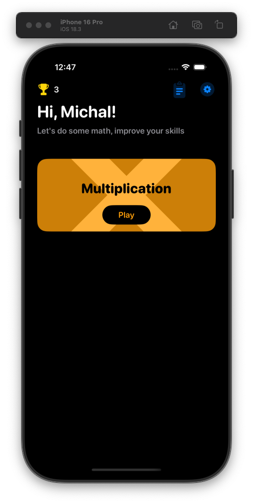](README_images/edu1.png)
[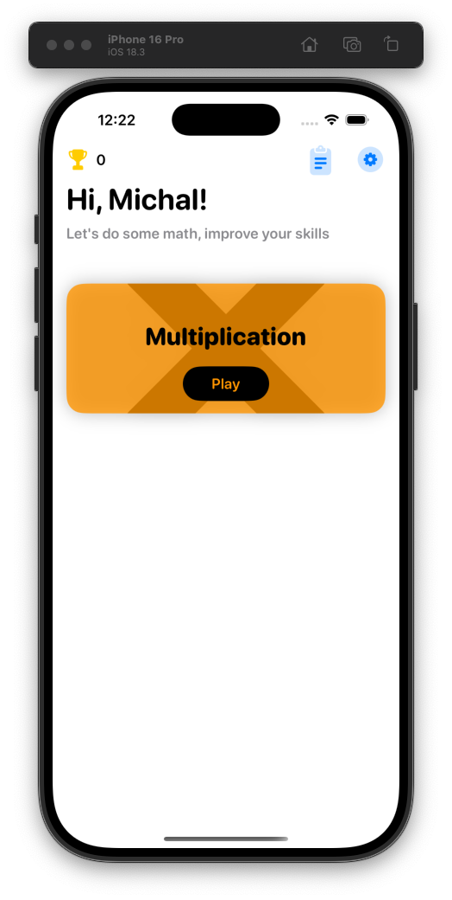](README_images/edu2.png)
[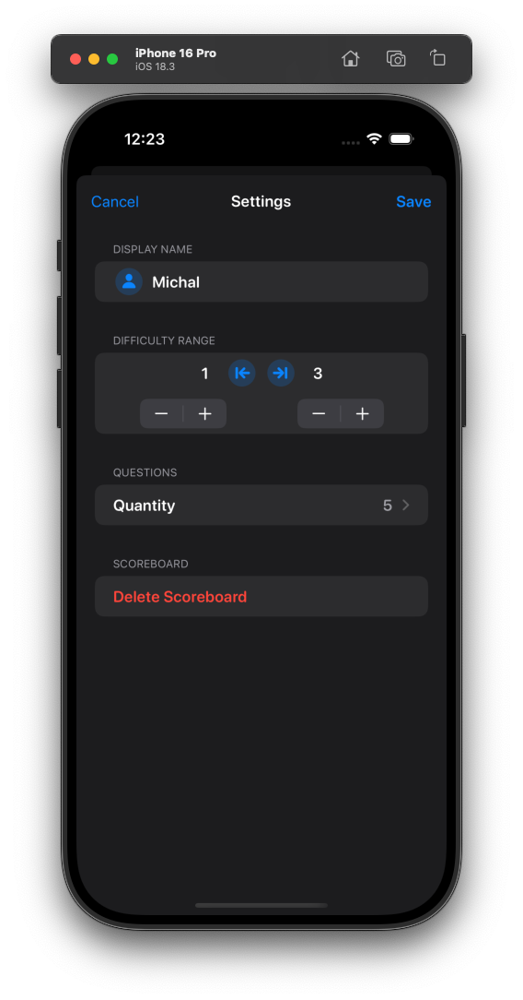](README_images/edu3.png)
[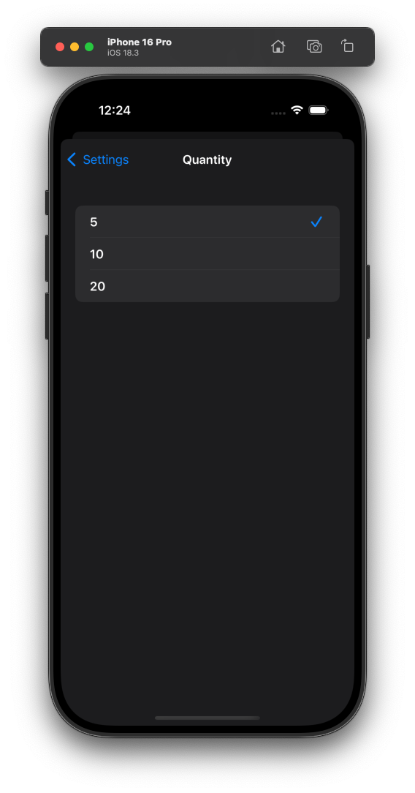](README_images/edu4.png)
[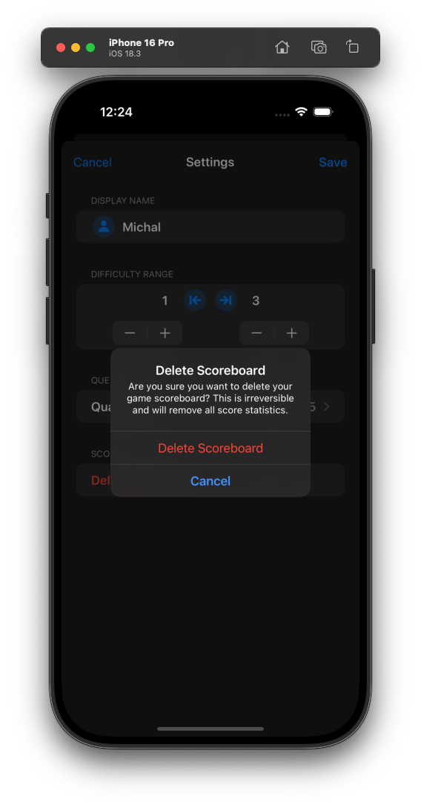](README_images/edu5.png)
[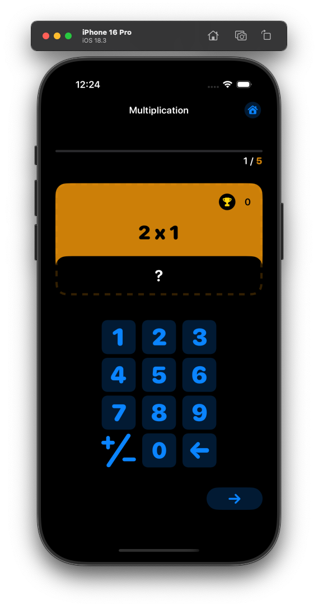](README_images/edu6.png)
[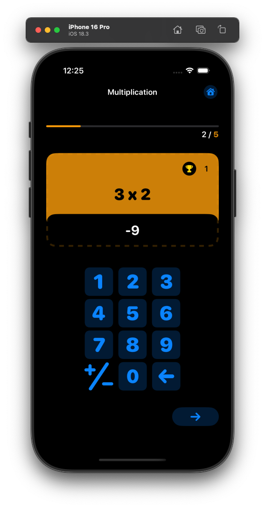](README_images/edu7.png)
[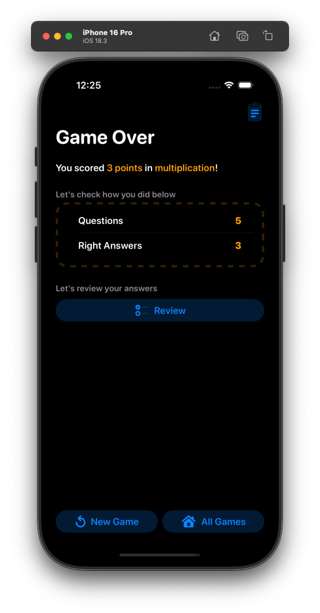](README_images/edu8.png)
[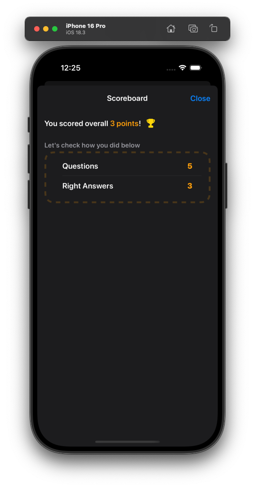](README_images/edu9.png)
[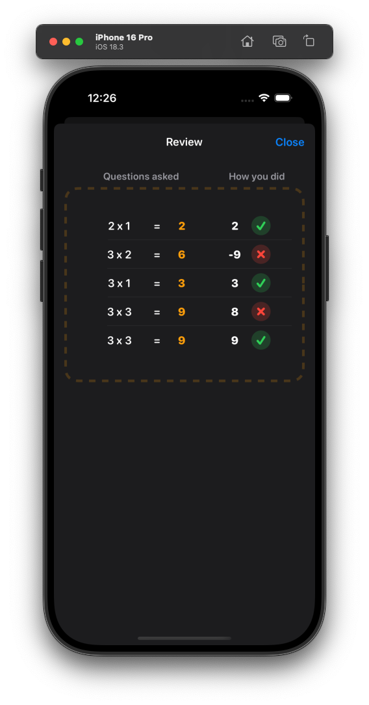](README_images/edu10.png)
[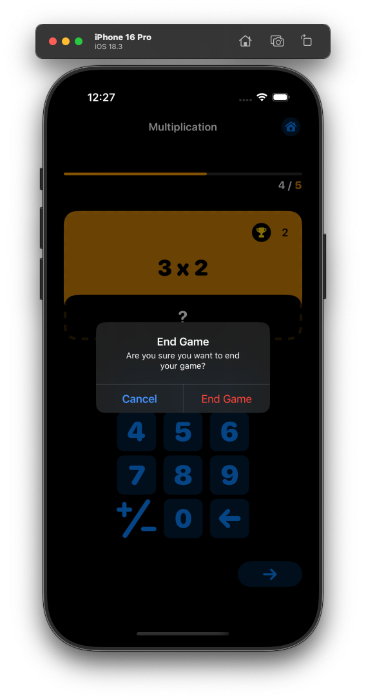](README_images/edu11.png)

<h3>Features</h3>

- Screens: Start Game, Settings, Current Game, Game Over, Review, Scoreboard
- Pure SwiftUI
- SFSymbols for icons
- Implemented UserDefaults for Settings and game Scoreboard (for learning purposes)
- Checked for different conditions(there are many in the game) for better game experience for ex. if player edits settings and decides to press cancel - latest data from saved settings in UserDefaults is being retrieved when screen is closed as per cancel button
- Game customization in Settings with display name, difficulty range, questions quantity and option to delete scoreboard statistics
- Implemented custom numberPad keyboard for the game
- Implemented Review for current game to check questions correctness
- Managed game class object using Observable Object protocol, @ObservedObject, @StateObject and @Published for properties
- Custom app icon
- Custom Fonts and colors as per Apple Human Guidelines
- Implemented NavigationTitleFontModifier for Navigation Title + TextStyleModifier for TextView
- Tested on physical and simulator
- Dark Mode Support
- Auto Layout for all iPhones

 