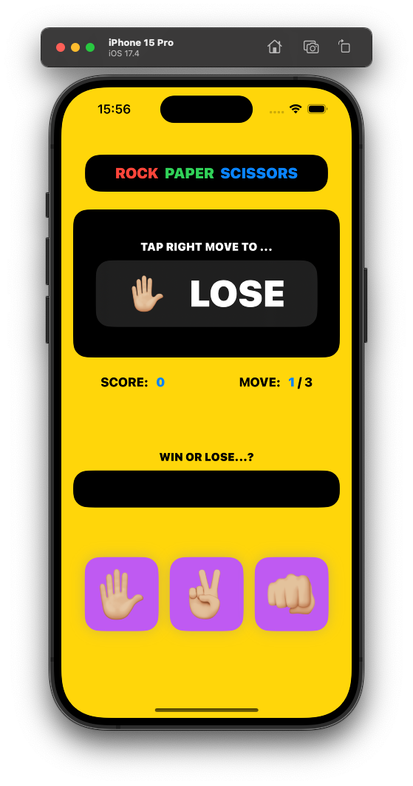

# SwiftUI-Apps
SwiftUI Apps created for self development and practice.

 

## Table of contents

- [Units](#units)
- [RPS](#rps)

 

## Units
Simple temperature conversion app to units like Celsius, Fahrenheit, or Kelvin.

<h3>Illustrations</h3

<h3>Features</h3>

- Screens: Temperature Conversion
- Pure SwiftUI
- Handles temperature conversion in Celsius, Fahrenheit, or Kelvin
- calculation performed using Apple Measurement API
- keyboard dismiss using @FocusState property wrapper
- Custom Fonts and colors as per Apple Human Guidelines
- Tested on physical and simulator
- Dark Mode Support
- Auto Layout for all iPhones

 

## Units
Simple RPS - Rock, Paper, Scissors game app that challenges player to tap correct move based on app randomly picked (Rock, Paper or Scissors) with random prompt to win or lose with live scoring (you can score a point or lose a point), move progress, final score alert message, restart etc.

<h3>Illustrations</h3

<h3>Features</h3>

- Screens: main game
- Pure SwiftUI
- Apple emoji icons for hand gestures
- Randomly picked: hand gestures by app, prompt for player to win or lose, move buttons every round by player
- Win or lose label displayed with green color (Win) or red color (Lose)
- Score feature with scoring points or losing based on move
- Move count for progress check
- Final score display using alert with restart of game
- Custom app icon
- Custom Fonts and colors as per Apple Human Guidelines
- Implemented custom Shadow Modifier for buttons
- Tested on physical and simulator
- Dark Mode Support
- Auto Layout for all iPhones

 